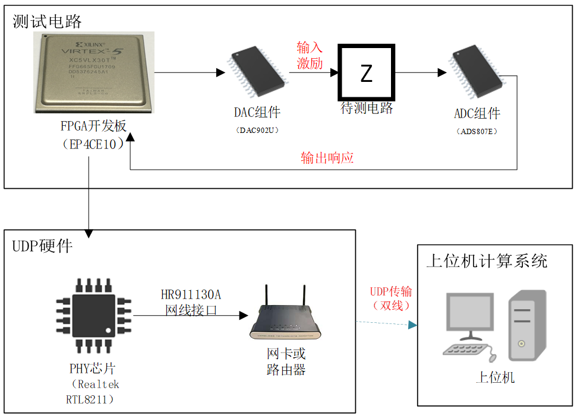
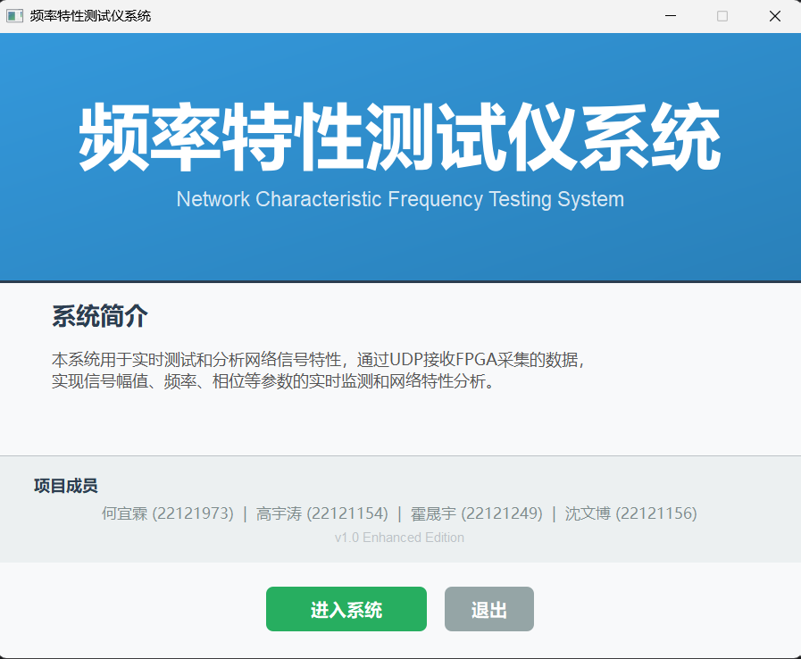
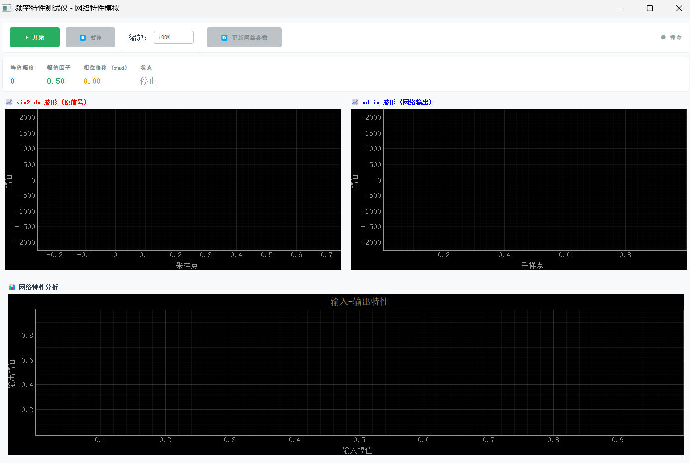
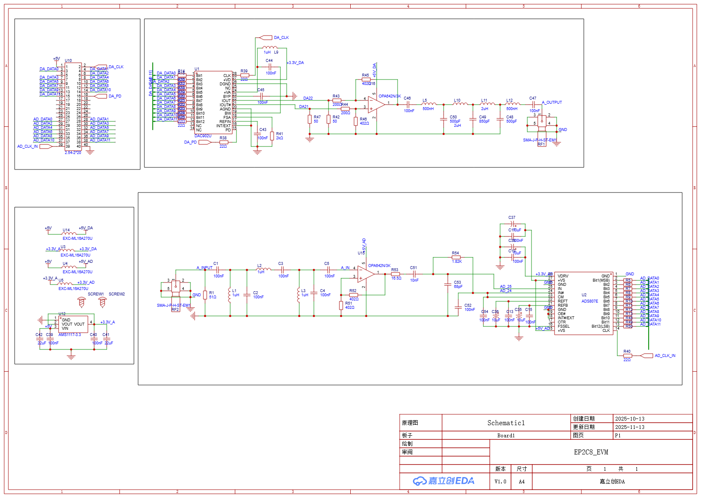
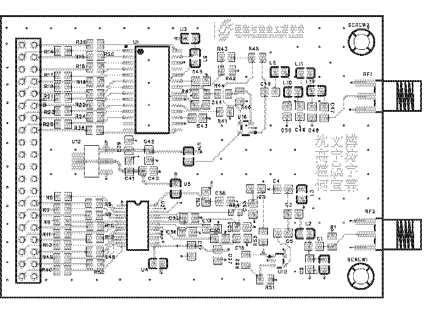
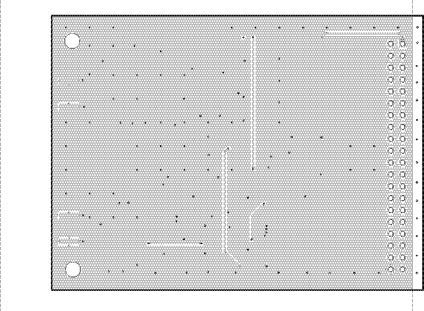
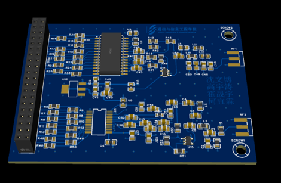

# Simple Frequency Response Analyzer Based on Intel FPGA

> **A dual-track educational system for electronic measurement and system identification**  
> Developed at **Shanghai University** | Completed: November 2025

This repository contains two complementary projects designed for **undergraduate electronics education**:

1. **🔬 High-Performance Frequency Response Analyzer (FPGA-based)**  
   A real-time, open-architecture instrument for measuring **amplitude and phase frequency characteristics** of analog circuits (150 Hz – 5 kHz).

2. **🔌 STM32-based Circuit Measurement System**  
   A low-cost, hands-on platform for **circuit frequency response measurement** using an STM32F4xx microcontroller, providing fundamental frequency analysis capabilities.

Together, they form a **progressive learning path**: from foundational circuit measurement to advanced frequency-domain analysis.

---

## 📁 Repository Structure

```
.
├── Electric_Circuit_Exploration/           # STM32电路测量系统
│   ├── DianSai111/                        # 电赛相关文件
│   ├── doc/                               # 文档
│   ├── logic_test/                        # 逻辑测试
│   ├── mcu_code/                          # STM32微控制器代码
│   └── vivado/                            # Vivado项目文件
├── EP4CE10_V1.1_Ethernet_1G/              # FPGA主项目
│   ├── Project/                           # Quartus项目文件
│   └── Ethernet.v                         # 以太网核心模块
├── fpga_model_matlab/                     # MATLAB仿真模型
│   ├── slprj/                             # Simulink缓存文件
│   ├── create_filter_test_simulation.m    # 滤波器测试仿真脚本
│   ├── FrequencyResponseTester.slx        # Simulink频率响应测试模型
│   ├── process_raw_data.m                 # 原始数据处理脚本
│   └── run_after_simulation.m             # 仿真后处理脚本
├── fpga_python/                           # Python主机应用程序
│   ├── __pycache__/                       # Python缓存
│   ├── freq_ui_enhanced.py                # 增强版频率响应UI
│   ├── main.py                            # 主程序入口
│   ├── package.json                       # Python包配置
│   ├── udp_receiver.py                    # UDP数据接收器
│   └── welcome_ui.py                      # 欢迎界面
├── PCB/                                   # PCB设计文件
│   ├── PCB制版文件.zip                    # PCB生产文件
│   ├── 工程教育PCB设计图.epro            # 工程教育PCB设计图
│   └── 物料清单BOM_Board.xlsx            # 物料清单
├── picture/                               # 项目图片
│   ├── PCB模型图.png                     # PCB 3D模型
│   ├── python上位机系统演示1.png        # Python GUI演示截图1
│   ├── python上位机系统演示2.png        # Python GUI演示截图2
│   ├── 电路原理图.png                    # 电路原理图
│   ├── 硬件搭载.jpg                      # 硬件实物照片
│   ├── 硬件系统框图.png                  # 硬件系统框图
│   ├── 装配图底层.png                    # PCB底层装配图
│   └── 装配图顶层.png                    # PCB顶层装配图
├── .git/                                  # Git版本控制
└── README.md                              # 项目说明文档
```

---

## 🧪 1. FPGA-Based Frequency Response Analyzer

### System Overview
The system uses an **Intel Cyclone IV EP4CE10 FPGA** to generate swept-sine signals via **Direct Digital Synthesis (DDS)**, drive the device under test through a **DAC902U**, and capture the response via **ADS807E**. Raw data are streamed over **Gigabit Ethernet (UDP)** to a Python host for real-time Bode plot visualization.



### Python GUI Application
The Python-based host application provides a comprehensive interface for controlling the analyzer and visualizing results:

- **Main Interface - Measurement View**:  
  

- **Detailed Analysis - Data Processing**:  
  

### Hardware Design
Custom PCBs were designed for high-speed mixed-signal performance, including proper power decoupling, ground separation, and impedance-aware routing.

- **Schematic**:  
  

- **PCB Layout (Top Layer)**:  
  

- **PCB Layout (Bottom Layer)**:  
  

- **3D Model Preview**:  
  

### Real-World Setup
The complete system in operation, interfacing with a test circuit and host PC:


---

## 🔌 2. STM32-based Circuit Measurement System

A comprehensive circuit analysis platform based on **STM32F4xx microcontroller**, designed for fundamental frequency response measurements. This system provides an accessible entry point for students to understand circuit analysis principles before advancing to the more sophisticated FPGA-based analyzer.

### Key Features:
- **Signal Generation**: Programmable waveform generation via DAC
- **Data Acquisition**: High-precision ADC sampling
- **Frequency Analysis**: Embedded FFT processing capabilities
- **Real-time Display**: On-board or PC-based visualization
- **Educational Focus**: Simplified interface for learning circuit analysis

### Measurement Capabilities:
- **Frequency Response**: Amplitude and phase measurement across frequency bands
- **Impedance Analysis**: Basic circuit impedance characterization
- **Transfer Function**: System transfer function estimation
- **Time-domain Analysis**: Waveform capture and analysis

> Full design files and firmware are in the [`Electric_Circuit_Exploration/`](Electric_Circuit_Exploration/) folder.

---

## 🚀 Quick Start Guide

### FPGA Frequency Response Analyzer

#### Hardware Setup
1. **Connect Hardware**:
   - Connect FPGA board to PC via USB (for programming)
   - Connect FPGA board to network via Ethernet cable
   - Connect signal output (DAC) to Device Under Test (DUT)
   - Connect DUT output to ADC input

#### Software Setup

##### 1. Program the FPGA
```bash
# Navigate to FPGA project
cd EP4CE10_V1.1_Ethernet_1G

# Open project in Quartus Prime
# 1. Open Quartus Prime
# 2. File → Open Project → Select Project directory
# 3. Tools → Programmer
# 4. Program FPGA with .sof file
```

##### 2. Run Python Host Application
```bash
# Navigate to Python application
cd fpga_python

# Install required packages
pip install -r requirements.txt
# If requirements.txt doesn't exist, install manually:
pip install numpy matplotlib pyqt5

# Run the application
python main.py
```

##### 3. Configure Network Settings
- Ensure PC is on same subnet as FPGA (default FPGA IP: `192.168.1.10`)
- Python application will listen for UDP packets on port `12345`

##### 4. Python GUI Features
The Python application includes:
- **Real-time Bode Plot**: Amplitude and phase response visualization
- **Sweep Control**: Adjust frequency range and step size
- **Data Export**: Save measurement results in CSV/Excel format
- **Signal Analysis**: FFT analysis and time-domain signal view
- **Filter Design**: Built-in filter synthesis tools

### STM32 Circuit Measurement System

```bash
# Navigate to STM32 project
cd Electric_Circuit_Exploration

# Open project in STM32CubeIDE or Keil
# 1. Open mcu_code/ directory in your IDE
# 2. Build and flash to STM32 board
# 3. Connect measurement probes to test circuits
# 4. Use serial terminal or custom GUI to control measurements
```

---

## 📊 MATLAB Simulation

The MATLAB/Simulink models can be used for simulation and verification:

```matlab
% Navigate to MATLAB models
cd fpga_model_matlab

% Run simulation setup
create_filter_test_simulation;

% Or open Simulink model
FrequencyResponseTester
```

---

## 🛠️ Development Tools

### Required Software
- **FPGA Development**: Intel Quartus Prime 18.1+
- **Python**: Python 3.7+ with PyQt5, NumPy, Matplotlib
- **MATLAB**: MATLAB R2020a+ with Simulink
- **STM32 Development**: STM32CubeIDE or Keil MDK
- **PCB Design**: JLCEDA (嘉立创EDA)

### Python Dependencies
```txt
numpy>=1.19.0
matplotlib>=3.3.0
pyqt5>=5.15.0
pandas>=1.2.0      # For data export
scipy>=1.6.0       # For signal processing
```

---

## 🔧 Key Components

### FPGA Core Files
- `EP4CE10_V1.1_Ethernet_1G/Ethernet.v` - Gigabit Ethernet interface
- `EP4CE10_V1.1_Ethernet_1G/Project/` - Complete Quartus project

### Python Application
- `fpga_python/main.py` - Main application entry point
- `fpga_python/freq_ui_enhanced.py` - Enhanced frequency response UI
- `fpga_python/udp_receiver.py` - UDP data receiver module
- `fpga_python/welcome_ui.py` - Welcome and setup interface

### STM32 Project
- `Electric_Circuit_Exploration/mcu_code/` - STM32 firmware source code
- `Electric_Circuit_Exploration/vivado/` - FPGA verification files
- `Electric_Circuit_Exploration/doc/` - Documentation and user guides

---

## 📈 Measurement Specifications

### FPGA Analyzer (Advanced System)
- **Frequency Range**: 150 Hz – 5 kHz
- **Signal Generation**: 16-bit DDS with programmable frequency
- **Data Acquisition**: 16-bit ADC @ 40 MSPS
- **Communication**: Gigabit Ethernet UDP
- **Real-time Display**: Amplitude & Phase Bode plots
- **GUI Features**: Real-time plotting, data export, filter design tools

### STM32 Measurement System (Entry-level)
- **Frequency Range**: 1 Hz – 10 kHz (typical)
- **Signal Generation**: 12-bit DAC with waveform synthesis
- **Data Acquisition**: 12-bit ADC with configurable sampling
- **Processing**: On-chip FFT and digital signal processing
- **Communication**: USB/UART interface for PC connectivity
- **Display**: Embedded display or PC-based visualization

---

## 🎓 Educational Applications

### Learning Progression

#### Level 1: STM32 System (Fundamentals)
1. **Basic Circuit Analysis**: Measure passive filter responses
2. **Signal Processing**: Understand sampling, aliasing, and FFT basics
3. **System Identification**: Characterize simple circuit transfer functions
4. **Embedded Programming**: Learn real-time measurement techniques

#### Level 2: FPGA System (Advanced)
1. **High-Speed Measurement**: Explore high-frequency circuit behavior
2. **Precision Analysis**: Understand quantization and noise effects
3. **Networked Instrumentation**: Learn distributed measurement systems
4. **Professional Tools**: Use industry-standard analysis techniques

### Laboratory Projects
- Design and characterize RC/LC filters with both systems
- Compare microcontroller vs. FPGA measurement approaches
- Implement adaptive filter algorithms
- Develop custom measurement protocols
- Analyze measurement accuracy and limitations

---

## 👥 Team

- **Huo Shengyu**  – FPGA architecture, UDP stack  
- **Shen Wenbo** – Python GUI, signal processing，FPGA architecture，PCB design
- **Gao Yutao** – STM32 firmware, analog front-end  
- **He Yilin** – FPGA architecture

**Supervisor**: Prof. Zhang Shaojun  
**Institution**: School of Communication and Electronic Engineering, Shanghai University

---

## 📜 License

License © 2025 Shanghai University Student Team

---

## 📞 Support

For technical support or questions:
1. Check the documentation in each module directory
2. Review the MATLAB simulation examples
3. Open an Issue on this repository
4. Contact the development team

---

## 🔄 Update Log

- **November 2025**: Initial release with complete FPGA and STM32 systems
- **Future Updates**: Planned GUI enhancements, more measurement features, and additional educational materials

---

**Note**: This project is designed for educational purposes. Always follow proper electrical safety procedures when working with live circuits.
